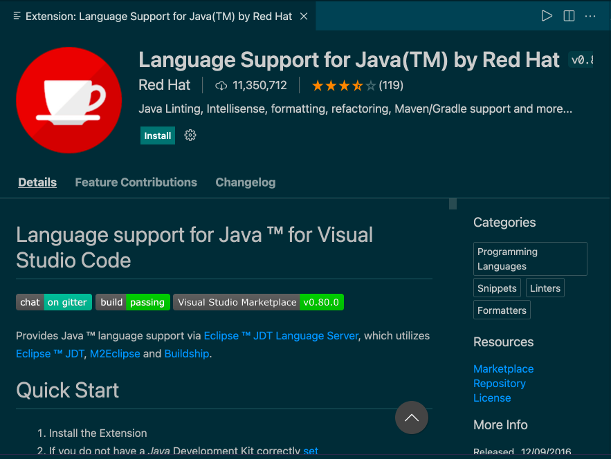
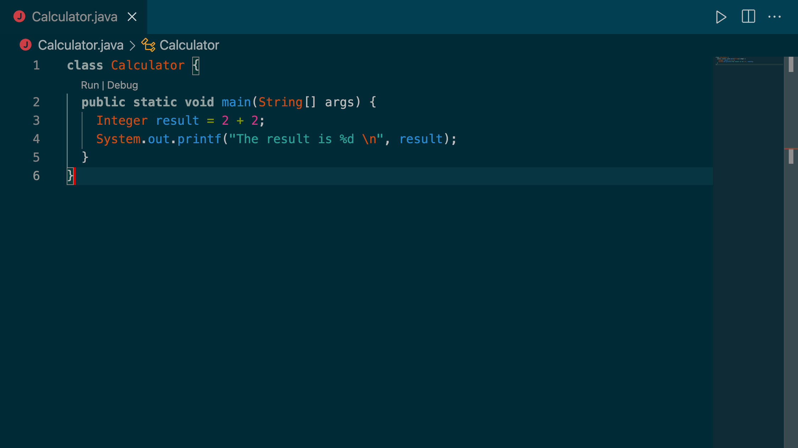

# Using an IDE

<!-- OMITTED -->

Most Java engineers don't use the terminal directly to compile and run Java code. When our program is split across many different files, it can become unpractical to run the `java` command directly and compile every class. Most of the time, you'd use an IDE to write Java programs. There are different IDEs available to us, in this section we'll use Visual Studio code with the extension ['Language Support for Java by Red Hat'](https://marketplace.visualstudio.com/items?itemName=redhat.java).

  * Install the extension and follow the Quick start guide on the extension page — you should already have the JDK installed from the first section of this module.
  * Install also the extension [Test Runner for Java](https://marketplace.visualstudio.com/items?itemName=vscjava.vscode-java-test) that we'll use in the next section.

  

You might need to reload or restart VS code after installing those.

Next, create a new project directory `calculator` and open this directory into VS code. Create a new file `Calculator.java` containing the class definition we used in the first section.

If the Java extension is installed correctly, you should see the two links `Run | Debug` appear right above the definition of the `main` method.

Clicking `Run` should compile and run the class thanks to the VS code extension. The terminal will open and display the program output.

In the following sections, we'll always use the same terminology to describe the following actions:
  * "Run the program/app" will mean running the `main` method with VS code — as explained above.
  * "Run the tests" will mean running a specific test suite with VS code — we'll cover this in the next section.

[Next Challenge](04_testing_with_junit.md)

<!-- BEGIN GENERATED SECTION DO NOT EDIT -->

---

**How was this resource?**  
[😫](https://airtable.com/shrUJ3t7KLMqVRFKR?prefill_Repository=makersacademy/java-apprenticeship-module&prefill_File=main/03_ide.md&prefill_Sentiment=😫) [😕](https://airtable.com/shrUJ3t7KLMqVRFKR?prefill_Repository=makersacademy/java-apprenticeship-module&prefill_File=main/03_ide.md&prefill_Sentiment=😕) [😐](https://airtable.com/shrUJ3t7KLMqVRFKR?prefill_Repository=makersacademy/java-apprenticeship-module&prefill_File=main/03_ide.md&prefill_Sentiment=😐) [🙂](https://airtable.com/shrUJ3t7KLMqVRFKR?prefill_Repository=makersacademy/java-apprenticeship-module&prefill_File=main/03_ide.md&prefill_Sentiment=🙂) [😀](https://airtable.com/shrUJ3t7KLMqVRFKR?prefill_Repository=makersacademy/java-apprenticeship-module&prefill_File=main/03_ide.md&prefill_Sentiment=😀)  
Click an emoji to tell us.

<!-- END GENERATED SECTION DO NOT EDIT -->
