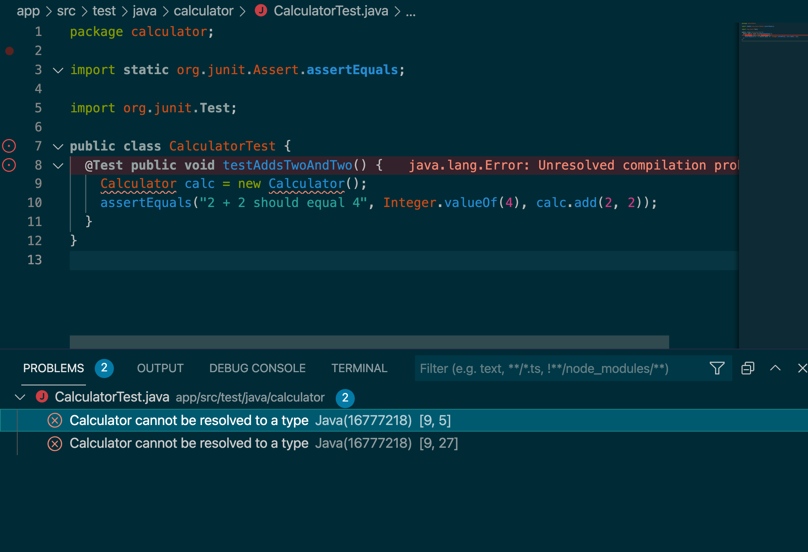
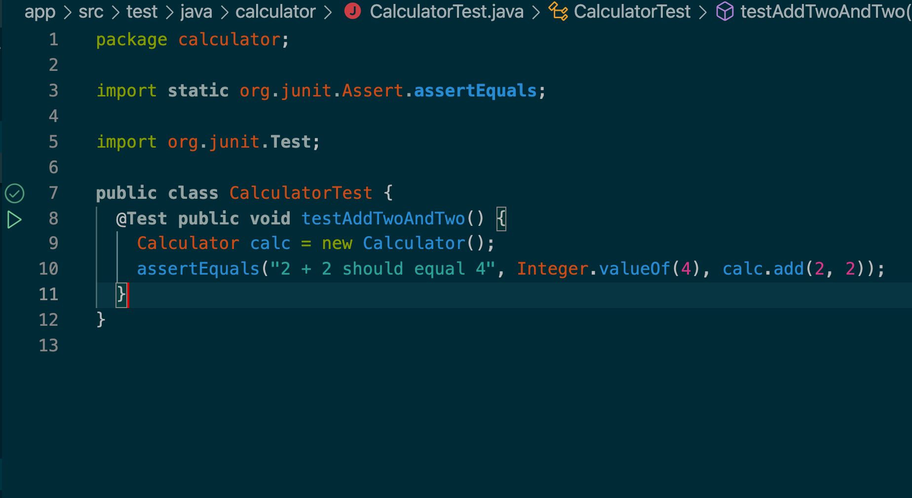
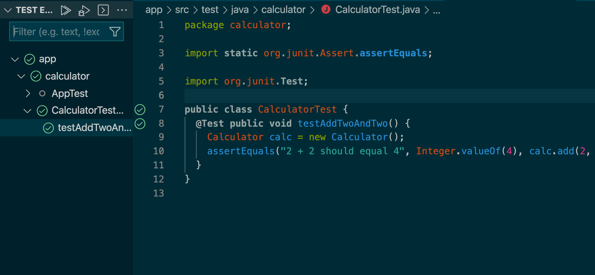
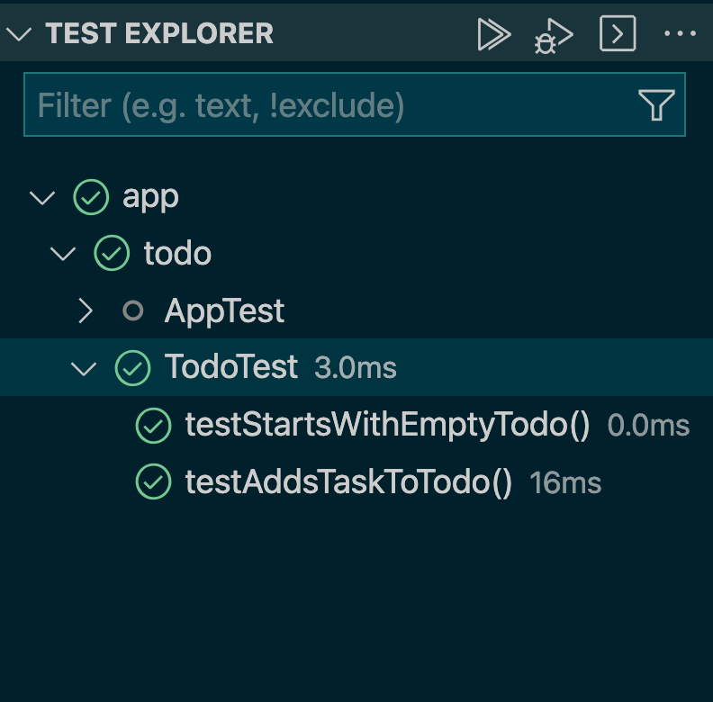

# Testing with JUnit

<!-- OMITTED -->

In Java, like in other programming languages, we can test-drive our programs to make sure we're building the right thing and that, later on, we don't accidentally break it. I.e. Test driving helps us to maintain high-quality code in a project.

We'll be using the JUnit library to write tests. 

## Installing JUnit with Gradle

We'll be using Gradle to setup our project. You can install it with Homebrew:

```
brew install gradle
```

We'll then create a new directory and run `gradle init` to do the initial setup and scaffolding:

```
mkdir calculator
cd calculator
gradle init
```

Gradle will then ask you some questions to setup the project, give the following answers:
1. application (type 2)
2. Java (type 3)
3. no (type 1)
4. Groovy (type 1)
5. JUnit 4 (type 1)
6. Default project name and source package

Here's what you will see when you run `gradle init`:

```bash
$ gradle init

Starting a Gradle Daemon (subsequent builds will be faster)

Select type of project to generate:
  1: basic
  2: application
  3: library
  4: Gradle plugin
Enter selection (default: basic) [1..4] 2

Select implementation language:
  1: C++
  2: Groovy
  3: Java
  4: Kotlin
  5: Scala
  6: Swift
Enter selection (default: Java) [1..6] 3

Split functionality across multiple subprojects?:
  1: no - only one application project
  2: yes - application and library projects
Enter selection (default: no - only one application project) [1..2] 1

Select build script DSL:
  1: Groovy
  2: Kotlin
Enter selection (default: Groovy) [1..2] 1

Select test framework:
  1: JUnit 4
  2: TestNG
  3: Spock
  4: JUnit Jupiter
Enter selection (default: JUnit Jupiter) [1..4] 1

Project name (default: calculator): 
Source package (default: calculator): 

> Task :init
Get more help with your project: https://docs.gradle.org/7.1.1/samples/sample_building_java_applications.html

BUILD SUCCESSFUL in 36s
2 actionable tasks: 2 executed
```

Gradle will then generate the directory structure for us. For now, you'll only be using two of these directories:
 * `app/src/test/java` - for the test classes containing individual test cases
 * `app/src/main/java` - for the program code itself

## Exercise: Writing our first JUnit test

<!-- OMITTED -->

We'll now open the project directory in VS code. The Java extension should start automatically. The editor might take a few moments to analyse the project directory.

*Note:* VS code might ask you "This workspace contains Java projects. Would you like to import them?" — in that case, you can select "Yes" or "Always".

Write the test class `CalculatorTest` in `app/src/test/java/calculator/CalculatorTest.java`.

```java
package calculator;

import static org.junit.Assert.assertEquals;

import org.junit.Test;

public class CalculatorTest {
  @Test public void testAddsTwoAndTwo() {
    Calculator calc = new Calculator();
    assertEquals("2 + 2 should equal 4", Integer.valueOf(4), calc.add(2, 2));
  }
}
```

Such a class is called a *test class* because it's not part of the program itself, but rather a class run to test the program — the methods of this class represent test cases for our program. There a few things that are new here:
  * The `@Test` identifier is called an *annotation*. You don't need to know exactly how they work for now, but remember this is a way for us to "annotate" some code to have special behaviour — in our case, JUnit knows which methods to run as tests thanks to this `@Test` annotation.
  * `assertEquals` is a method we can call in our tests, similar to other languages `expect()` or `test()` — we use it to assert a given value is the same or equal to an expected value.

You may now see an error because the class `Calculator` referenced in our test is not defined yet. To run the tests and see more about the error, we can click on the "play" icon next to the line the test is defined — this also works if we want to run all the tests for the whole test class `CalculatorTest`.



Your next assignment will be to implement the `Calculator` class. When you've done that and run the tests, you'll see something more like this:



We can also right-click on this icon and chose "Reveal in test explorer" to get more details on the tests that were run and their status.



### Questions

1. Write the class `Calculator` in the file `app/src/main/java/calculator/Calculator.java` to make the test above pass.
2. In the previous test, try to replace `Integer.valueOf(4)` by the number `4` and run the tests again. What happens?

Attempt the exercise by yourself before watching the following video:
[Example Solution](https://www.youtube.com/watch?v=xiWQG7g7LCQ)

## About return types

You've noticed that we also need to specify the types of values returned by methods. For example, in the previous exercise, we need to be specific about what type the `add` method is going to return — in that case, probably a numeric type such as `Integer`.

```java
public Integer add(Integer a, Integer b) // takes two integers, returns an integer
```

You might have also noticed some methods, such as the program `main` method, and test methods, have a `void` return type:

```java
public void testAddsTwoAndTwo()
```

This happens when we don't need methods to return any useful value. For example, the `main` method executes the program, but doesn't need to return a result. Similarly, test methods run assertions to verify our program is working, but don't need to return anything.


## Exercise

Let's now revisit the `PriceDisplay` class from the first section. Instead of doing everything in the `main` method, we're going to TDD a `getPriceLabel` method that does the same job:
  * it takes two arguments — an item name and a price
  * it returns the string `"The price for item: <item name> is <price>"`

To complete this exercise, you'll have to:
  * setup a new project directory.
  * write a test annotated with the `@Test` annotation.
  * write a method with the correct argument types and return type.
  * use [`String.format`](https://dzone.com/articles/java-string-format-examples) to format the result string.

### Questions

1. Initialise a new project directory with Gradle.
2. Test-drive this new method `getPriceLabel` on the `App` class by:
    * writing a new test method in `AppTest` to verify the output is right for the given inputs.
    * implementing the method on the `App` class so the test passes.

Attempt the exercise by yourself before watching the following video:
[Example Solution](https://www.youtube.com/watch?v=v_Gc7BKD338)

## Exercise - debugging

Someone else in your cohort wrote the code below for the `Calculator` class, but it seems something is not working for them.

```java
package gradle;

public class Calculator {
  public String add(Integer a, Integer b) {
    return a + b;
  }
}

```

1. Try this code and run the tests. What happens?
2. Can you see what the issue is? Make the fix so the test pass.

## Stretch exercise — a To-do list

<!-- OMITTED -->

To complete this exercise, you'll have to:
  * setup a new project directory using `gradle` like we did before.
  * use the type `ArrayList<String>` to hold a list of values.
  * write a class and its methods.
  * write a JUnit test class and test cases.
  * use VS code to run the tests.

### Questions

1. Setup a new project directory named `todo`.
2. Write tests for a `Todo` class (in a test file `app/src/test/java/todo/TodoTest.java`) such as:
   * it is initialised with an empty list of tasks.
   * it has a `addTask` method that takes a `String` argument and adds it to the list of tasks.
   * it has a `getTasks` method that returns the list of tasks.
3. Implement the `Todo` class (in a file `app/src/main/java/todo/Todo.java`) to those tests pass.

To get you started, here's the scaffolding for the `TodoTest` class you can use:

```java
package todo;

import static org.junit.Assert.assertEquals;

import org.junit.Test;

public class TodoTest {
  // write test cases here
}
```

You should end up for a result similar to this one in the VS code test explorer:




Attempt the exercises by yourself before watching the following video:
[Example Solution](https://www.youtube.com/watch?v=RqS-qWocn6I)


[Next Challenge](05_challenge_game.md)

<!-- BEGIN GENERATED SECTION DO NOT EDIT -->

---

**How was this resource?**  
[😫](https://airtable.com/shrUJ3t7KLMqVRFKR?prefill_Repository=makersacademy/java-apprenticeship-module&prefill_File=main/04_testing_with_junit.md&prefill_Sentiment=😫) [😕](https://airtable.com/shrUJ3t7KLMqVRFKR?prefill_Repository=makersacademy/java-apprenticeship-module&prefill_File=main/04_testing_with_junit.md&prefill_Sentiment=😕) [😐](https://airtable.com/shrUJ3t7KLMqVRFKR?prefill_Repository=makersacademy/java-apprenticeship-module&prefill_File=main/04_testing_with_junit.md&prefill_Sentiment=😐) [🙂](https://airtable.com/shrUJ3t7KLMqVRFKR?prefill_Repository=makersacademy/java-apprenticeship-module&prefill_File=main/04_testing_with_junit.md&prefill_Sentiment=🙂) [😀](https://airtable.com/shrUJ3t7KLMqVRFKR?prefill_Repository=makersacademy/java-apprenticeship-module&prefill_File=main/04_testing_with_junit.md&prefill_Sentiment=😀)  
Click an emoji to tell us.

<!-- END GENERATED SECTION DO NOT EDIT -->
